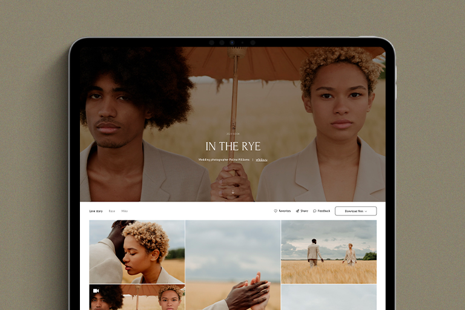

# 120 GB for free

**Client Gallery** is a service where you can share photos with clients beautifully, increase your income, and attract new clients without advertising expenses. It simplifies your interactions with clients and makes it more effective. With the help of our Galleries you can create personal galleries, select pictures for retouching, and sell photos and photo books.

<figure><figcaption></figcaption></figure>

### How to get a free plan

* **Upload the photos that you want to share with your client.** You can also upload videos.
* **Make a post or create a reel on Instagram** on how you share photos via the Galleries with a mention of our **Instagram account** [**@wfolio.gallery**](https://instagram.com/wfolio.gallery)**.** \
  Attach a screenshot or a video of your gallery in the preview mode. The post needs to show how your gallery looks like from your clients' perspective.


We created aesthetic templates for your post. You can make an original post with your photos or use our templates. Download them by following [**this link**](https://free.wfolio.pro/disk/120gb-plan-p485kv).


* **Send us a link in the support chat**\
  Send us a message with the words _**I want Wfolio Galleries**_ and a link to your post. We will activate the free plan for **6 months**. After 6 months, you can make a new post and we will extend your plan. You can contact us via the webchat, on our Instagram [@wfolio.gallery](https://www.instagram.com/wfolio.gallery), or on Telegram [@wfoliobot](https://t.me/wfoliobot).

You can expand 120 GB of storage space to 240 GB, 1000 GB or Unlimited at any time in the control panel.


Please notice that we only accept posts or reels with a mention of our account and a screenshot or video of your project on Drive.

We don't accept stories on Instagram.


***

#### Instagram post example

<figure><figcaption></figcaption></figure>

***

#### Client Gallery review video



Text us if you have any questions. We will be glad to help!
