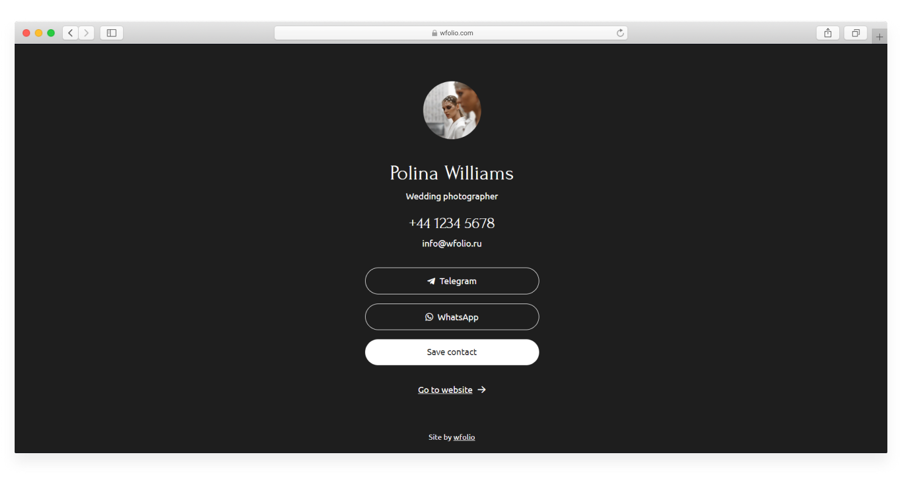

# Easy start

The **Cloud Drive** section is a built-in service for sharing photos with clients and business card with your contacts.

Are you also sharing photos through a file sharing service? Then don’t be surprised why word-of-mouth marketing doesn’t work for you.

Sharing files through the Cloud Drive on the site will allow you to:

* Make photo sharing beautiful.
* Develop word-of-mouth marketing.
* Receive customer feedback.



## How it works 

The built-in drive on your site **is not a** **faceless file sharing service**, but a beautiful gallery for your clients. The drive contains all your contacts: phone, messengers, links to social networks and the site.

Just upload the photos and send the customer a link to view and download them.


Clients will be happy to share the link with their friends.


This gives **an explosive increase** in attendance from family, reportage, wedding or other group shootings.

In addition, the use of the drive has a positive effect on the search engine promotion of your site, since it is at the address of your site and the drive traffic is summed up with the traffic on your site.

## Business card 

[**Business card**](https://wfolio.com/my/card) - this is a multi-link page with your contacts where a client can contact you.&#x20;

The business card is displayed:&#x20;

* On the "Website + Drive" plan - at the domain address with the addition of "/me", for example, **mydomain.com/me**
* On the "Drive Only" plan - at your domain address, for example, **mydomain.com**

<figure><figcaption></figcaption></figure>

## **FAQ** 

* **Is it possible to create protected galleries?**\
  Drive galleries are accessible only through a direct, unique link. You can also additionally set a password to the gallery.
* **Will my client be able to create a list of favorite photos?**\
  Yes, your clients will be able to select photos in galleries. With the help of the «Favorites» function it is easy to create a list of photos for a book, retouching, slideshow, and so on.
* **What can I upload to the drive?**\
  Uploading photos, videos and any other files is supported.
* **Can I make several folders?**\
  Yes.
* **Is there a mobile version?**\
  Yes, galleries are displayed great on all devices.
* **How can I collect customer feedback?**\
  After downloading the photos, the client will be asked to leave feedback, which you can publish on your website.
* **Is there language switching option?**\
  Yes. You can choose a different language for a project and your business card in the settings of a project.

Use the Cloud Drive in your work, forget about faceless file sharing!

### Gallery examples 

In most cases, real projects on the drive are not intended for public demonstration, so we have prepared examples of galleries on test drive for you: [examples.md](../examples.md "mention").
