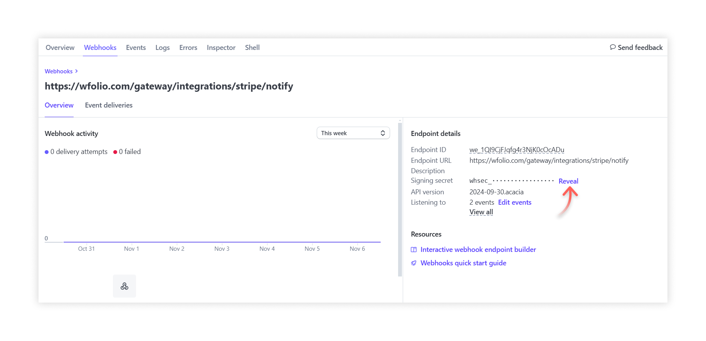
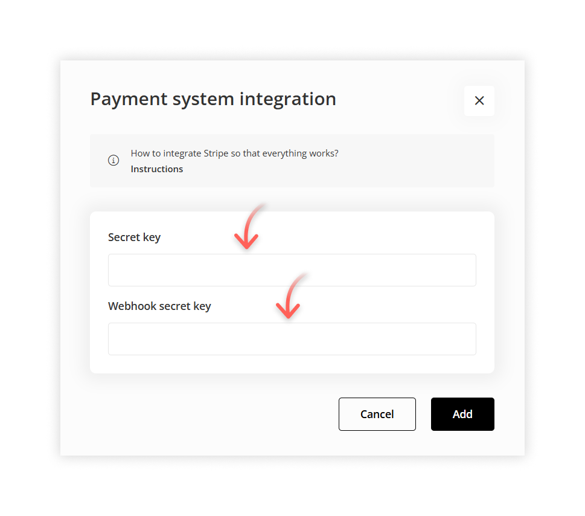

# Stripe connection

[**Stripe**](https://stripe.com/) is a payment system available to entrepreneurs in [over 40 countries](https://stripe.com/global), allowing them to accept payments from customers worldwide.


### Supported currencies <a href="#currencies" id="currencies"></a>

Supported currencies include EUR, USD, GBP, CHF, DKK, SEK, AUD, KZT, ILS, INR, RON, PLN, BGN, THB, AED, CZK, CAD, BRL. Total currencies available—more than 130. The minimum charge amount varies depending on the currency.

<a href="https://docs.stripe.com/currencies?presentment-currency" class="button secondary">All currencies</a>   <a href="https://docs.stripe.com/currencies?presentment-currency#minimum-and-maximum-charge-amounts" class="button secondary">Minimum charge amount</a>

### How to connect Stripe

* Go to the [**Stripe**](https://stripe.com/) website and sign up. Fill in all required fields. After registration, you will receive a confirmation email. Follow the link in the email.
* After confirming the mail, fill in the information about your business to activate your account. [**Add business information**](https://dashboard.stripe.com/account/onboarding). Provide detailed information about your company.
* After activation of the company, go to the **Developers** → [**Webhooks**](https://dashboard.stripe.com/webhooks). Click on the **Add destination** button.

<figure><figcaption></figcaption></figure>

* In **Events**, search for **checkout.session.completed** and **checkout.session.expired** events. Choose the events.

<figure><figcaption></figcaption></figure>

* In **Destination types,** choose **Webhook endpoint.**

<figure><figcaption></figcaption></figure>

* In **Endpoint URL**, enter the address:

```
https://wfolio.com/gateway/integrations/stripe/notify
```

* Create the endpoint destination.

<figure><figcaption></figcaption></figure>


You need two keys to connect Stripe: **a secret API key** and **a secret webhook key**. We will describe how to copy and paste the secret API key first.

* Go to the Developers → [**API Keys**](https://dashboard.stripe.com/apikeys) section, click on the **Reveal key** button and **copy the secret key**.

<figure><figcaption></figcaption></figure>

* The key for the second field is in the **Developers** → [**Webhooks**](https://dashboard.stripe.com/webhooks) tab. Return to it. In the **Webhook endpoints** section, click on the created endpoint.
* In the **Signing secret** line, click on the **Reveal** button. **Copy the second key.**

<figure><figcaption></figcaption></figure>


The instructions describe how to connect Stripe in the **test mode**. To turn it off, click on the **Test mode** switch in the upper right corner and **copy the keys again**.



Go to the **Store settings** tab in the **Shop** and select Stripe. Paste the API key in the **Secret key** field and the webhook key (starts with `wh`) in the **Webhook secret key** field.

<figure><figcaption></figcaption></figure>

Stripe payment system is connected. Now you can add products:

[📖 How to sell products and services on the website](../shop/site/products.md)

[📖 How to sell products and services on the drive](../shop/gallery/products.md)
