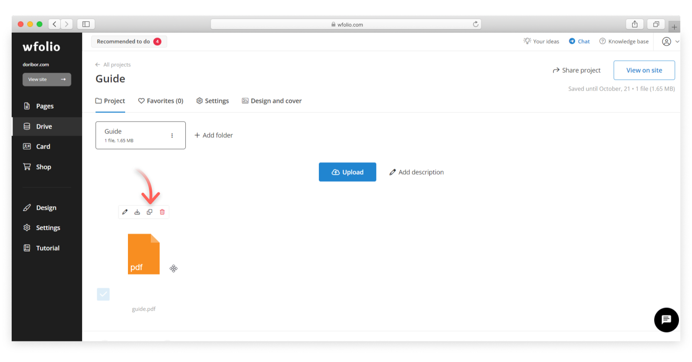
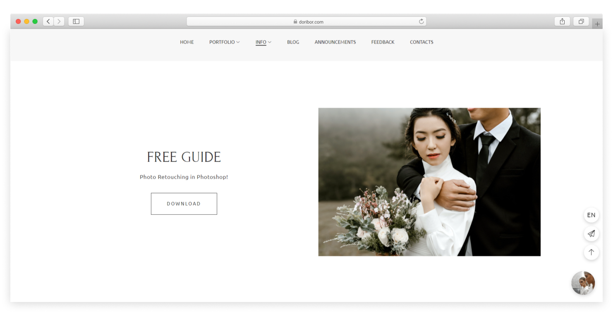
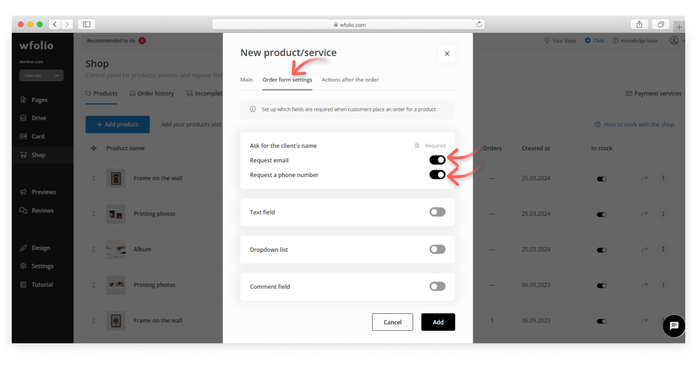
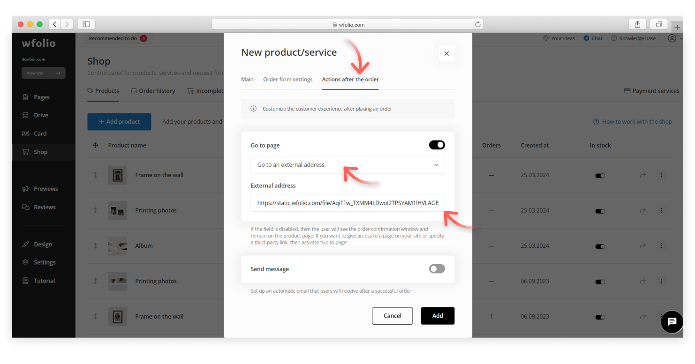

# Add files for downloading

You can add a downloadable file to the site, for example, a guide, price list, certificate, archive, manual, and so on. The file can be in any format, as long as its size does not exceed 300 MB.

How to do it step by step:

#### 1. Upload the file on the cloud drive

* Create a new project on the **Drive** and upload the file for downloading.
* Click on the **Copy link** icon.

<figure><figcaption></figcaption></figure>

#### 2. Add a download button to the site

* Add a block with a button on the page, in order to do that click on the **+** icon.
* Select a block with a button.
* Go to the button settings.

<figure><figcaption></figcaption></figure>

#### 3. Place a link to your file on the button

A link can be placed in two ways:

1. To download by clicking on the button. The download will start after the button is clicked.
2. To download after filling out the form. The download will start after a visitor fills out the form on the site. This option is useful for gathering visitors' contacts.

Let’s look at each option.

***

## Download by clicking on the button

* In the button settings, select the **External link** tab and paste the copied link to the file.

<figure><figcaption></figcaption></figure>

As a result, website visitors will be able to download the file by clicking on the button.

<figure><figcaption>
Example of a page with a download button
</figcaption></figure>

## Download after filling out the form

Use this method if you want to collect visitors' contact.  After form is filled, you will receive an email with the contact details.

* Select the **action Open product/service** and click on the **Adding and editing products** button.

<figure><figcaption></figcaption></figure>

* In the opened window, add a file card by clinking on the **Add product** button. Fill the name and description. For the payment method select **Order request (price not specified)**.

<figure><figcaption></figcaption></figure>

* Move to the **Order form settings** tab and edit the fields for the form.

<figure><figcaption></figcaption></figure>

* Go to the **Actions after the order** tab. Choose external address in the **Go to the page** option and paste the copied link in the field.

<figure><figcaption></figcaption></figure>

* Return to the button settings and add the created guide card.

<figure><figcaption></figcaption></figure>

As a result, a contact form opens after clicking on the button. The file will be downloaded once the form is filled.

<figure><figcaption>
Example of a page with a contact form for downloading
</figcaption></figure>
