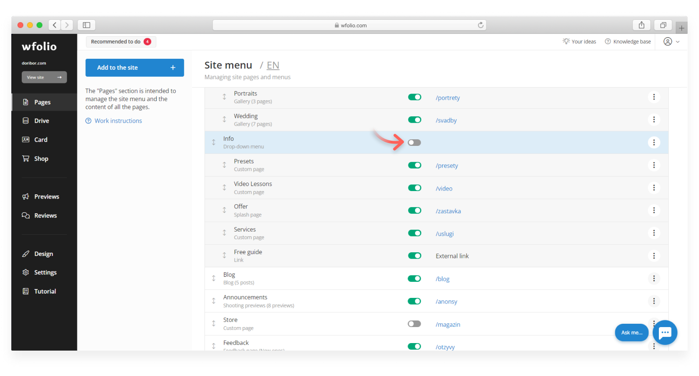
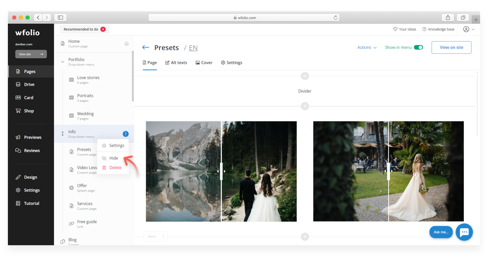

# How to hide a page

The hidden page is not displayed in the site menu and is accessible only through a direct link. There are several options for hiding a page, album, or dropdown menu:

In the **Pages** section turn off the switch in the **Display** column next to the pages you want to hide.

<figure><figcaption></figcaption></figure>

* When editing a page. Turn off the **Show in Menu** switch at the top of the page to hide it.

<figure><figcaption></figcaption></figure>

* In the side menu. Hover over the page you want to hide. Click on the **ellipsis (⋮)** at the end of the line and select **Hide**.

<figure><figcaption></figcaption></figure>

You can enable or disable the indexing of hidden pages by search engines in the **Main settings** section.
