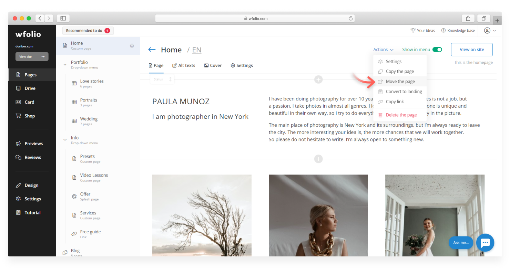

# How to move a page/album

To move a page or an album to a drop-down menu or album gallery you need:&#x20;

* Open the page for editing and click on **«Actions»** in the upper right corner and select **«Move the page»** in the drop-down menu.

<figure><figcaption></figcaption></figure>

* In the drop-down list choose the place where you want to move the page and click **«Move».**&#x20;

<figure><figcaption></figcaption></figure>
