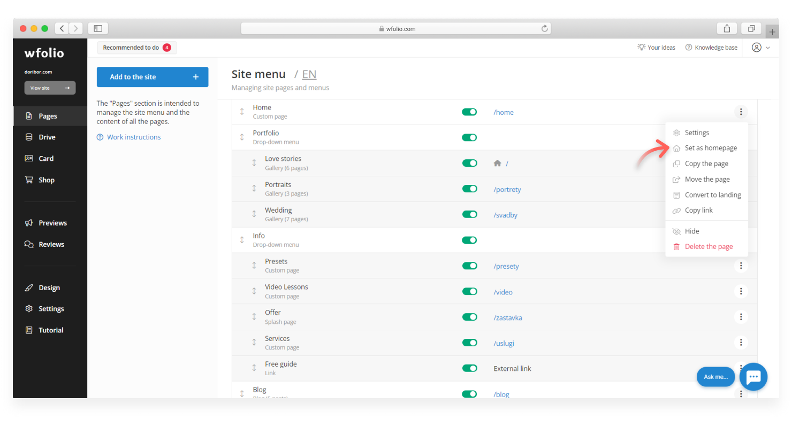
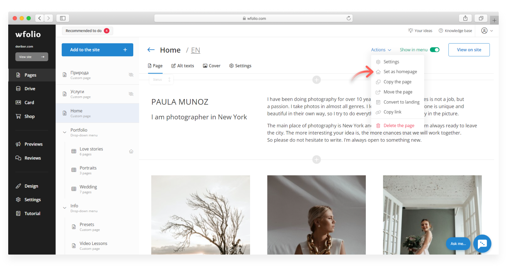

# How to set a homepage

Homepage is the page that will be opened first when you visit your site by domain (site address). You can set any page on your site as the homepage.

There are several options for setting a page as the homepage:

* In the [**Pages**](https://wfolio.com/my/site) section. Hover the cursor over the page that you want to set as the homepage. Click on the **ellipsis (⋮)** at the end of the line and select **«Set as the Homepage»**.

<figure><figcaption></figcaption></figure>

* When editing a page, click on **«Action»** and select **«Set as the Homepage»**.

<figure><figcaption></figcaption></figure>
